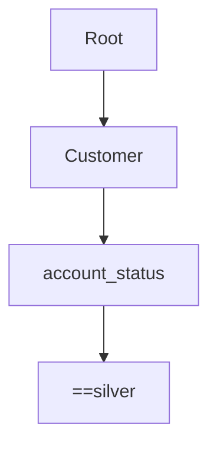
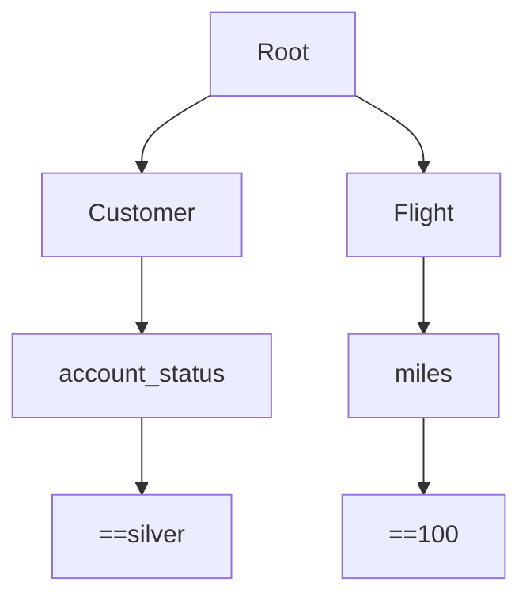
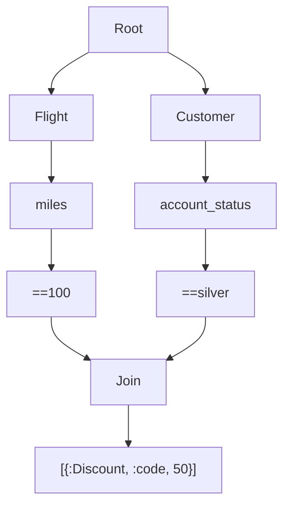
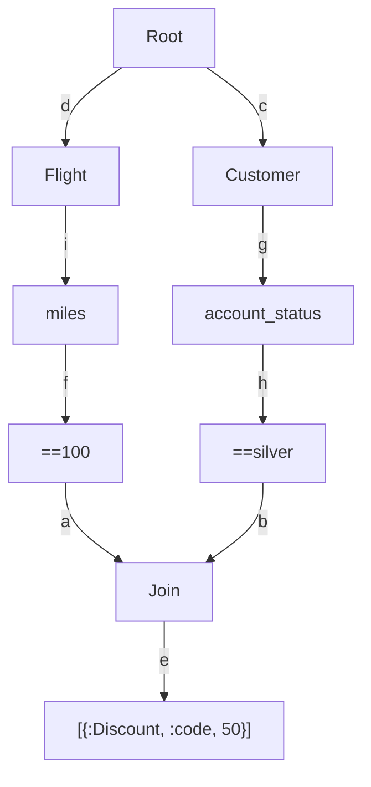

# NeuralBridge

**A way to mimic human decision making, incredibily fast - An expert system built in Elixir**

"Soon after the dawn of modern computers in the late 1940s – early 1950s, researchers started realizing the immense potential these machines had for modern society. One of the first challenges was to make such machine capable of “thinking” like humans. In particular, making these machines capable of making important decisions the way humans do. The medical / healthcare field presented the tantalizing challenge to enable these machines to make medical diagnostic decisions.

Thus, in the late 1950s, right after the information age had fully arrived, researchers started experimenting with the prospect of using computer technology to emulate human decision-making. For example, biomedical researchers started creating computer-aided systems for diagnostic applications in medicine and biology. These early diagnostic systems used patients’ symptoms and laboratory test results as inputs to generate a diagnostic outcome. These systems were often described as the early forms of expert systems." - [Wikipedia](https://en.wikipedia.org/wiki/Expert_system)

## How does it work?

The algorithm utilizes symbols to create an internal representation of the world. Each element in the real world is converted into a triple known as a "Working Memory Element" (`Retex.Wme.t()`), represented as {Entity, attribute, attribute_value}.

The world is represented through facts (WMEs) and Rules. A Rule consists of two essential parts: the "given" (right side) and the "then" (left side).

To perform inference, the rule generates a directed graph starting from a common and generic Root node, which branches out to form leaf nodes. The branches from the Root node correspond to the initial part of the WME, representing the working memory elements or "Entity". For instance, if we want to represent a customer's account status as "silver", we would encode it as "{Customer, account_status, silver}". Alternatively, with the use of a struct, we can achieve the same representation as Retex.Wme.new("Customer", "account status", "silver").

Now, let's explore how this would appear when compiling the rete algorithm with Retex:



**example nr. 1**

Now, let's examine the graph, which consists of four nodes in the following order:

1. The Root node
   1. This node serves as the root for all type nodes, such as Account, Customer, God, Table, and so on.
2. The Customer node
   1. Also known as a Type node, it stores each known "type" of entity recognized by the algorithm.
3. The account_status node
   1. Referred to as a Select node, it represents the attribute name of the entity being described.
4. the ==silver node
   1. Known as a Test node, it includes the == symbol, indicating that the value of Customer.account_status is checked against "silver" as a literal string (tests can use all Elixir comparison symbols).

By expanding this network, we can continue mapping various aspects of the real world using any desired triple. Let's consider the entity representing a Flight, specifically its number of miles. We can represent this as {Flight, miles, 100} to signify a flight with a mileage of 100. Now, let's incorporate this into our network and observe the resulting graph:

Let's add this to our network and check what kind of graph we will get:



**example nr. 2**

Now we begin to observe the modeling of more complex scenarios. Let's consider the addition of our first inference to the network, which involves introducing our first rule.

The rule we want to encode states that when the Customer's account_status is "silver" and the Flight's miles are exactly "100," we should apply a discount to the Customer entity.

Let's examine how our network will appear after incorporating this rule:



Now we have constructed our network, which possesses a symbolic representation of the world and describes the relationships between multiple entities and their values to trigger a rule. Notably, the last node in the graph is represented as {:Discount, :code, 50}.

Let's examine how we can interpret this graph step by step:

1. At the first level, we encounter the Root node, which serves as a placeholder.
2. At the second level, we find the Flight and Customer nodes branching out from the Root node. It's important to note that they are at the same level.
3. Both the Flight and Customer nodes branch out only once since they each have only one attribute.
4. Each attribute node (==100 and ==silver) branches out once again to indicate that if we encounter the attribute Customer.account_status, we should verify that its value is indeed "silver."
5. The last two nodes (==100 and ==silver) both connect to a new anonymous node called the Join node.
6. The Join node branches out only once, leading to the right-hand side of the rule (also known as the production node).

This structure of the graph allows us to represent and process complex relationships and conditions within our network.

## What are join nodes?

Join nodes are also what is called "beta memory" in the original C. Forgy paper. To make it simple we can assert that they group together a set of conditions that need to be true in order for a rule to fire. In our last example, the rule is:

```
# pseudocode
given: Flight.miles == 100 and Customer.account_status == "silver"
then: Discount.code == 50
```

In the graph representation, the Join node corresponds to the "and" in the "given" part of the rule. Its purpose is to evaluate and combine the conditions associated with its two parent nodes. Notably, a Join node can only have and will always have exactly two parents (incoming edges), which is a crucial characteristic of its design.

By utilizing Join nodes, the network is able to effectively represent complex conditions and evaluate them in order to trigger the corresponding rules.

## What are production nodes?

Production nodes, as named in the Forgy paper, refer to the right-hand side of a rule (also known as the "given" part). These nodes are exclusively connected to one incoming Join node in the network.

To clarify, the purpose of a production node is to represent the actions or outcomes specified by the rule. It captures the consequences that should occur when the conditions specified in the Join node's associated "given" part are met. This relationship ensures that the rule's right-hand side is only triggered when the conditions of the Join node are satisfied.

## How do we use all of that after we built the network?

Once we have a graph like the following and we know how to read it let's imagine we want to use to make inference and so to understand if we can give out
such discount code to our customer.


This process is called adding WMEs (working memory elements) to the network. As you might have already guessed there is very little difference between a WME and a part of a rule.

`Retex` exposes the function `Retex.add_wme(t(), Retex.Wme.t())` which takes the network itself and a WME struct and tries to activate as many nodes as possible traversing the graph from the Root until each reachable branch executing a series of "tests" at each node. Let's see step by step how it would work.

Let's rewrite that same graph adding some names to the edges so we can reference them in the description:



Let's see what happens when adding the following working memory element to the Retex algorithm `Retex.Wme.new(:Flight, :miles, 100`

1. Retex will receive the WME and start testing the network from the Root node which passes down anything as it doesn't test for anything
2. The `Root` branches out in `n` nodes (Flight and Customer)
   1. the branch `d` will find a type node with value "Flight" and this is the first part of the WME so the test is passing
      1. the next branch from `d` is `i` which connects Flight to `miles` and so we test that the second part of the triple is exactly `miles`: the test is passing again
         1. the next branch from `i` is `f` which finds a test node `== 100` which is the case of our new WME and so the test is passing
            1. next is `a` which connects to the `Join` node which needs to be tested: a test for a Join node asserts that all incoming connections are active (their test passed) and given that the branch `b` is not yet tested the traversal for now ends here and the Join remains only 50% activated
   2. the second branch to test is `c` which connects to `Customer` and this is not matching `Flight` so we can't go any further

After adding the WME `Retex.Wme.new(:Flight, :miles, 100)` the only active branches and nodes are d, i, f and a

Our rule can't be activated because the parent node `Join` is not fully active yet and so it can't propagate the current WME to the production node (which is sad but fair)

Let's see what happens when adding the following working memory element to the Retex algorithm `Retex.Wme.new(:Customer, :account_status, "silver")`

1. Retex will receive the WME and start testing the network from the Root node which passes down anything as it doesn't test for anything
2. The `Root` branches out in `n` nodes (Flight and Customer)
   1. the branch `c` will find a type node with value "Customer" and this is the first part of the WME so the test is passing
      1. the next branch from `c` is `g` which connects Customer to `account_status` and so we test that the second part of the triple is exactly `account_status`: the test is passing again
         1. the next branch from `h` finds a test node `== "silver"` which is the case of our new WME and so the test is passing
            1. next is `b` which connects to the `Join` node which needs to be tested: a test for a Join node asserts that all incoming connections are active (their test passed) and given that the branch `a` is also already active (we stored that in a map) we can continue the traversal
               1. Now we find a production node which tells us that the Discount code can be applied
   2. the second branch to test is `d` which doesn't match so we can stop the traversal

After adding the WME `Retex.Wme.new(:Customer, :account_status, "silver")` all nodes are active and so the production node ends up in the agenda (just an elixir list to keep track of all production nodes which are activated)

We have now done inference and found an applicable rule. All we need to do now is to add the new WME to the network to check if any other node can be activated in the same way.

Now imagine adding more and more complex rules and following the same strategy to find activable production nodes. The conditions will all be joined by a `Join` (and) node
and will point to a production.


## How does the rule application work?

Each time you insert a fact (be it by inference from a rule or a new standalone fact), the agenda might grow or shrink and produce new applicable rules. Each rule will then be applied until each of them has been applied once for each matching fact.


## What kind of syntax can I use in the given of a rule?

In the given of a rule you can only use comparison statements such as:

```
   Lorenzo's surname is equal "sinisi"
   Lorenzo's age is greater 28
   Lorenzo's country is equal "Germany"
   Lorenzo's language is equal "italian"
   Germany's language is equal "german"
   Dog's age is unknown
```


And in a given of a rule you can use insertion statements that translate to WMEs and functions:

```
   Lorenzo's surname is "sinisi"
   Lorenzo's age is 28
   Lorenzo's country is "Germany"
   Lorenzo's language is "italian"
   Germany's language is "german"
   let $second_surname = second_surname_of($sinisi)
   Lorenzo's second_surname is $second_surname
```


## Installation

```elixir
def deps do
  [
    {:neural_bridge, git: "https://github.com/lorenzosinisi/neural_bridge"}
  ]
end
```


## Examples and usage

# Rule engine in Elixir - Rete

```elixir
Mix.install([
  {:neural_bridge, git: "https://github.com/lorenzosinisi/neural_bridge"}
])
```

## Example 1: calculate the net salary of an employee in the UK

```elixir
rules = [
  NeuralBridge.Rule.new(
    id: 1,
    given: """
    Person's salary is equal $salary
    """,
    then: """
    let $monthly_salary = div($salary, 12)
    Person's monthly_salary is $monthly_salary
    """
  ),
  NeuralBridge.Rule.new(
    id: 2,
    given: """
    Person's monthly_salary is equal $monthly_salary
    """,
    then: """
    let $payout = mult($monthly_salary, 0.64)
    Salary's net_amount is $payout
    """
  ),
  NeuralBridge.Rule.new(
    id: 2,
    given: """
    Salary's net_amount is equal $amount
    """,
    then: """
    Salary's net_amount is $amount
    """
  )
]

facts = """
Person's salary is 60000
Person's employment_type is "Full-time"
Person's location is "UK"
"""

NeuralBridge.Session.new("uk")
|> NeuralBridge.Session.add_rules(rules)
|> NeuralBridge.Session.add_facts(facts)
|> Map.fetch!(:inferred_facts)
```

## Example 2: dynamic pricing

In this example, the rules calculate the discount to be applied to a customer based on the number of items they have bought in a month. The discount percentages are determined as follows:

* If the customer has bought 5 items, the discount percentage is set to 20%.
* If the customer has bought less than 2 items, the discount percentage is set to 0%.
* If the customer has bought exactly 3 items, the discount percentage is set to 10%.

```elixir
rules = [
  NeuralBridge.Rule.new(
    id: 1,
    given: """
    Customer's number_of_items_bought is equal 5
    """,
    then: """
    Customer's discount_percentage is 0.2
    """
  ),
  NeuralBridge.Rule.new(
    id: 1,
    given: """
    Customer's number_of_items_bought is lesser 2
    """,
    then: """
    Customer's discount_percentage is 0.0
    """
  ),
  NeuralBridge.Rule.new(
    id: 1,
    given: """
    Customer's number_of_items_bought is equal 3
    """,
    then: """
    Customer's discount_percentage is 0.1
    """
  )
]

facts = """
Customer's number_of_items_bought is 5
"""

[
  %Retex.Wme{
    identifier: "Customer",
    attribute: "discount_percentage",
    value: 0.2
  }
] =
  NeuralBridge.Session.new("uk")
  |> NeuralBridge.Session.add_rules(rules)
  |> NeuralBridge.Session.add_facts(facts)
  |> Map.fetch!(:inferred_facts)
```

## Example 3: loan approval

```elixir
rules = [
  NeuralBridge.Rule.new(
    id: 1,
    given: """
    Applicant's credit_score is greater 700
    """,
    then: """
    Loan's approval_status is "approved"
    """
  ),
  NeuralBridge.Rule.new(
    id: 2,
    given: """
    Applicant's credit_score is lesser 500
    """,
    then: """
    Customer's at_risk is true
    Loan's approval_status is "rejected"
    """
  )
]

facts = """
Applicant's credit_score is 499
"""

[
  %Retex.Wme{
    identifier: "Customer",
    attribute: "at_risk",
    value: true
  },
  %Retex.Wme{
    identifier: "Loan",
    attribute: "approval_status",
    value: "rejected"
  }
] =
  NeuralBridge.Session.new("uk")
  |> NeuralBridge.Session.add_rules(rules)
  |> NeuralBridge.Session.add_facts(facts)
  |> Map.fetch!(:inferred_facts)
```

## Example 3: workflow automation

```elixir
rules = [
  NeuralBridge.Rule.new(
    id: 1,
    given: """
    SupportTicket's opening_time_hours greater 24
    SupportTicket's id is equal $ticke_id
    """,
    then: """
    SupportTicket's escalation_level "high"
    SupportTicket's escalated is $ticke_id
    """
  )
]

facts = """
SupportTicket's opening_time_hours is 25
SupportTicket's id is "123AB_ID"
"""

[
  %Retex.Wme{
    identifier: "SupportTicket",
    attribute: "escalation_level",
    value: "high"
  },
  %Retex.Wme{
    identifier: "SupportTicket",
    attribute: "escalated",
    value: "123AB_ID"
  }
] =
  NeuralBridge.Session.new("uk")
  |> NeuralBridge.Session.add_rules(rules)
  |> NeuralBridge.Session.add_facts(facts)
  |> Map.fetch!(:inferred_facts)
```


This library is just glue for two projects [Retex](https://github.com/lorenzosinisi/retex)
and the DSL [Sanskrit](https://github.com/lorenzosinisi/sanskrit). Retex and Sanskrit can
be put together to form an expert system in Elixir as shown in the examples above.


If you have any comment or question feel free to open an issue here


#### References:
- [Rete algorithm](https://en.wikipedia.org/wiki/Rete_algorithm)
- [Expert system](https://en.wikipedia.org/wiki/Expert_system#:~:text=In%20artificial%20intelligence%2C%20an%20expert,than%20through%20conventional%20procedural%20code.)
- [Forgy's paper](http://www.csl.sri.com/users/mwfong/Technical/RETE%20Match%20Algorithm%20-%20Forgy%20OCR.pdf)
